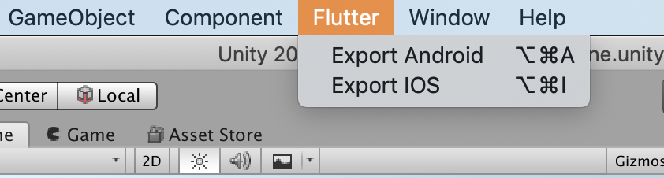

# flutter_unity_demo

This project demonstrates bidirectional communication between unity project and flutter app using [flutter_unity_widget](https://pub.dev/packages/flutter_unity_widget).

## To Run

1. Open the unity project which is inside unity folder (unity/demo/) using unity hub.

2. Click "Export Android" option under the "Flutter" tab. This will build and generate unityLibrary folder (android/unityLibrary)
   

3. For android run the app on real device.

## Setup and Further Workaround

Follow the setup procedure mentioned in [flutter_unity_widget](https://pub.dev/packages/flutter_unity_widget#setup).

## Versions

- Unity Editor: 2020.3.26f1
- flutter_unity_widget: 4.2.3
- Flutter: 2.8.1
- Dart: 2.15.1
